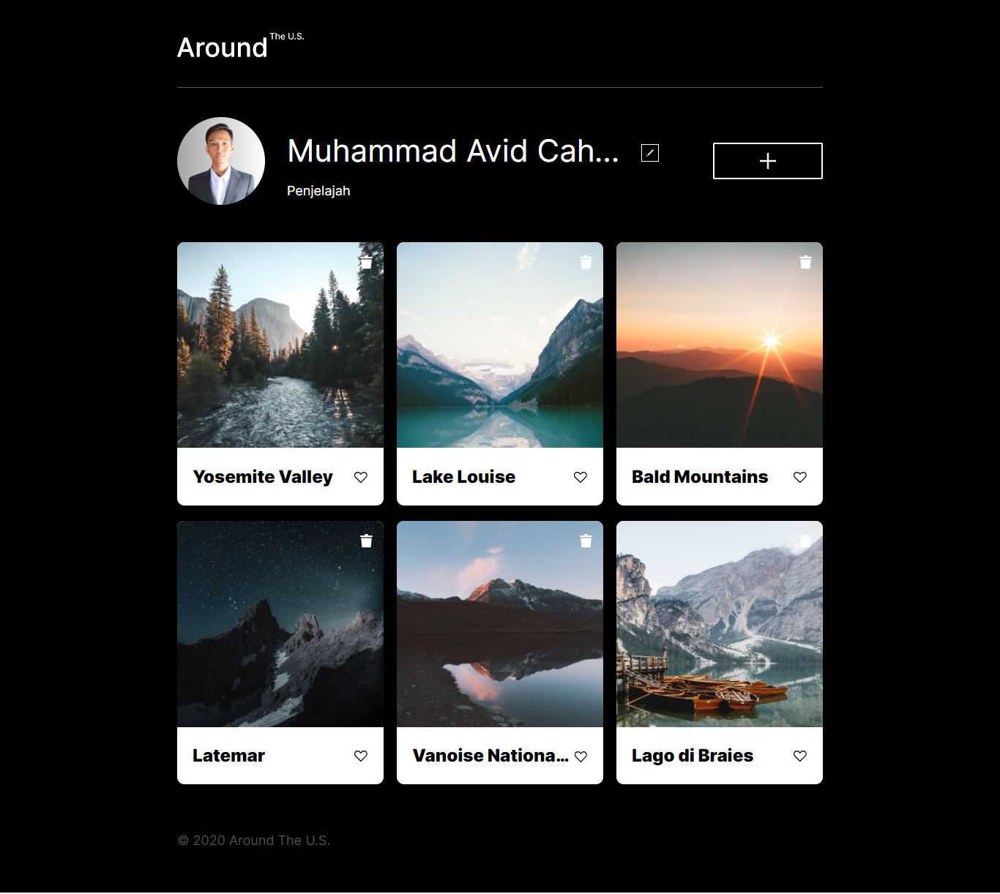

# Tripleten web_project_around

Dalam proyek web ini, penerapan HTML, CSS yang mengikuti aturan BEM (Block Element Modifier) dan JavaScript telah dilakukan, sehingga landing page ini responsif di semua ukuran layar perangkat.

## 1. HTML (BEM Notation):

Nama kelas dalam HTML mengikuti konvensi BEM (Block Element Modifier) untuk meningkatkan keterbacaan dan pemeliharaan.
Contoh: class="header**logo", class="profile**name", class="popup\_\_button"

## 2. CSS (BEM Notation):

Penggunaan nama kelas dalam CSS juga mengikuti aturan BEM.
Contoh:
css

.header\_\_logo {
/_ styles for header logo _/
}

.profile\_\_name {
/_ styles for profile name _/
}

.popup\_\_button {
/_ styles for popup button _/
}

## 3. Responsif menggunakan CSS Media Queries:

Penggunaan CSS Media Queries untuk membuat tata letak dan tampilan yang responsif di berbagai ukuran layar.
Contoh:
css
Copy code
@media screen and (max-width: 768px) {
/_ styles for screens up to 768px wide _/
}

@media screen and (min-width: 769px) and (max-width: 1024px) {
/_ styles for screens between 769px and 1024px wide _/
}

## 4. JavaScript Responsif:

- Penggunaan JavaScript untuk menangani interaksi dan memastikan fungsionalitas yang responsif.
- Contoh: Menyesuaikan perilaku tombol atau popup berdasarkan ukuran layar.

() Dengan menerapkan aturan BEM, HTML dan CSS menjadi lebih terstruktur dan mudah dipahami. Media queries memungkinkan halaman web untuk menyesuaikan diri dengan berbagai perangkat, sedangkan JavaScript dapat digunakan untuk meningkatkan responsivitas dan interaktivitas. Dengan kombinasi ini, landing page menjadi optimal di semua ukuran layar.
